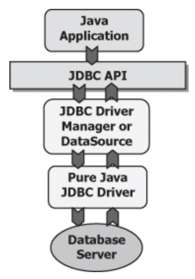

# JDBC components

The most popular JDBC components are located at the following packages:
* java.sql - contains the standard JDBC components
* javax.sql - contains the Standard Extension of JDBC, which provides additional features, such as Java Naming and Directory Interface (JNDI) and Java Transaction Service (JTS).
* oracle.jdbc - contains the extended functions provided by the java.sql and javax.sql interfaces.
* oracle.sql - contains classes and interfaces that provide Java mappings to SQL data types.

The JDBC API contains two major sets of interfaces: the first is the JDBC API for application writers (interface to your Java applications), and the second is the lower-level JDBC driver API for driver writers (interface to your database). JDBC technology drivers fit into one of four categories.

The architecture of JDBC:

The most common interfaces that we will use from JDBC (java.sql) are:

What do these five interfaces do? On a very high level, we have the following:

* Driver - Establishes a connection to the database
* Connection - Sends commands to a database
* PreparedStatement - Executes a SQL query
* CallableStatement - Executes commands stored in the database
* ResultSet -  Reads results of a query
